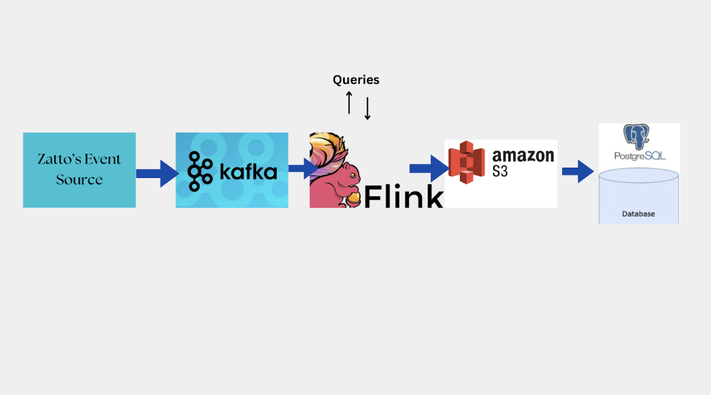

# stream-stats
Deep dive trend analysis of an app similar to netflix

# Overview
This is the Architecture Diagram for Zattoo’s multi-tenant platform.

## Internal flow

### Source ingestion
The applications/devices will generate events every 4 seconds and send them to the Kafka cluster. In Kafka, there are topics. The mentioned fields will go into Kafka in the form of topics. Then streams of topics are created, and those go to our Apache Flink (the event processing layer).

### Processing
Flink will handle incoming events, validate them, and perform transformations or aggregations as needed. In this scenario, we are asked to check the stream every 4 seconds. Hence, we will pass that as the configuration, e.g., in one session how many streams we want to process, its interval.

Moreover, Flink does two things:

1. **Assigns every tumbling window based on the session_id**: (a type of trigger that fires at a specific time interval from a specified start time, keeping the state of the event).

2. **Managing states**:
    - **Updating Session State**: Flink checks the event_time with the last saved time for the session_id in the session_state topic. If the new event_time is in the time window, the session is still going. Flink updates the last event_time for that session in the session_state topic.
    - **Timeout**: If no event happens for a session_id within the time window, it means the session is over.

3. After the window processing, the system checks if the session timed out (no event happened for 60 seconds after the last event_time).

4. If the session is ended, it figures out the watch time by subtracting the start_time from the last event_time stored in the state store to calculate the total duration.

5. Finally, the system writes the final session data’s fields (user_id, program_id, start_time, session_id, device, stream_duration) to the database.

We want data to be delivered to our DWH with strong consistency and low latency. Hence, we break it down into 2 steps:
1. **1st stage**: Data is consumed by a Flink application from Kafka and uploaded to S3 in the Parquet/raw file format. Data from Flink to S3 is uploaded via Flink’s StreamingFileSink. It offers exactly-once delivery and customized bucketing on S3, which can be used for partitioning the data at the directory level.
2. **2nd stage**: We use AWS Data Pipeline, a web service, to read data from S3 and write it to PostgreSQL. The pipeline is configured to run at intervals close to real-time (e.g., every 60 seconds). Once the stream_duration is calculated, we write the session information (user_id, program_id, start_time, session_id, device, stream_duration) to a PostgreSQL database.

6. Simultaneously, Flink can send logs and monitoring data for its operations or any errors or unusual behavior.

## Why these tools?

### Kafka: Stream
Firstly, it is open-source and can ingest a high volume of real-time data. It is highly durable and linearly scalable, which is required for the multi-tenant architecture at Zattoo. Kafka is ideal for fault tolerance, multi-region deployments, and self-service. This makes it easier for our entire ecosystem of microservices to produce and consume meaningful events and leverage asynchronous communication.

### Flink: Compute
Flink is a powerful stream processing framework for real-time data. Its approach to ‘event time processing’ is particularly useful in this scenario. Data streams are processed based on the time they were generated, rather than the time they arrive at the system. Even though in this case study for session termination, the last captured event after 60 seconds is needed, Flink can handle out-of-order events and late data without much hassle.

The requirements here involve processing in real-time and ultra-low latency. Hence, Flink is chosen as it is highly fault-tolerant and checks the state of the system by checkpointing. If failures occur, it restores to the last state and continues from that point. Although Spark could have been used, it uses micro-batching and is not a good option for ultra-low latency applications like Flink.

Flink supports stateful computation during data processing, making it efficient for more complex session states of the application. Any kind of time-based operations can be dealt with more efficiently, e.g., querying or manipulating streaming data using Flink’s SQL API.

### S3: Data Lake
S3 separates storage from compute resources, allowing us to scale storage independently. It supports different data formats like Parquet. For Zattoo, which handles a lot of data, we can also employ Iceberg (an open-source table format) to organize data into smaller files.

### Postgres: OLAP
Postgres can store the final session records after the stream ends. It is reliable, supports ACID transactions, and can be scaled vertically and horizontally for read and write operations. It can be optimized with indexing and partitioning to handle large datasets and provide efficient query performance.

### Grafana: Monitor
Grafana monitors at the app/tool level. For example, in Flink, if a lot of data comes in, it indicates that memory is over-consumed, allowing alerts to be sent to the teams at Zattoo.

## Special Considerations

### Scalability Factor
- Kafka can produce multiple clusters. For example, if the volume of Zattoo’s events quickly increases, they can be expanded to multiple Kafka clusters, and event-to-cluster mapping is possible.
- Flink has dynamic scaling. This means if the workload varies, it can automatically rebalance across its clusters.

